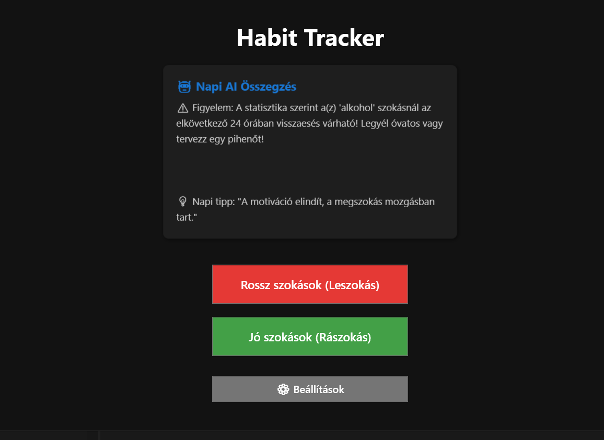
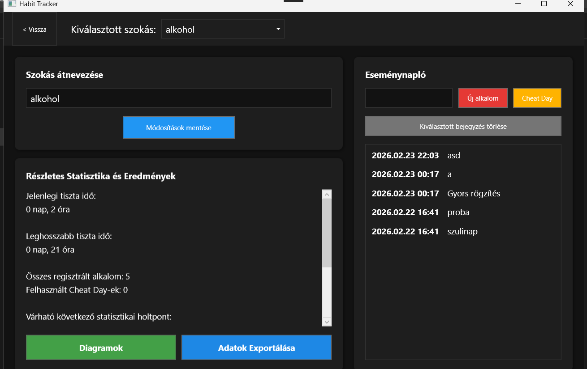
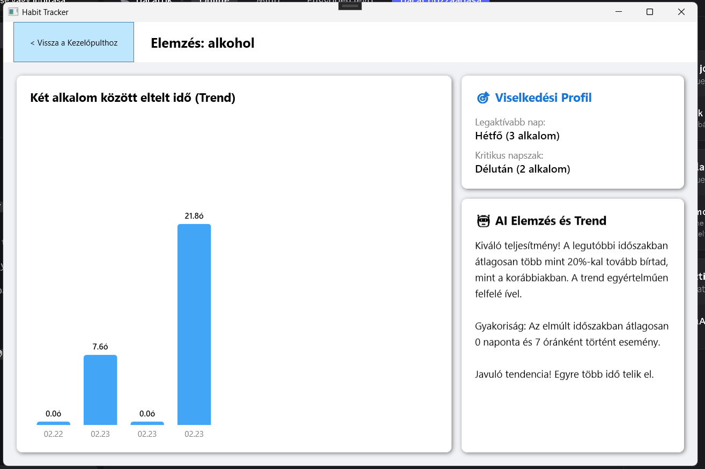

# HabitTracker - Intelligens Szokáskövető Alkalmazás

Egy modern, funkciókban gazdag asztali alkalmazás (WPF), amely segít a jó szokások kialakításában és a rosszak elhagyásában. A program beépített statisztikai motorral, viselkedéselemzéssel és dinamikus értesítésekkel támogatja a felhasználót a céljai elérésében. Kiváló referenciaprojekt, amely bemutatja a komplex asztali technológiák (SPA navigáció, háttérfolyamatok, dinamikus témák) gyakorlati alkalmazását.

##  Főbb funkciók

- **Kettős Logika (Jó és Rossz szokások):** - *Rossz szokások:* Pontos visszaszámlálás az utolsó botlás óta, a tiszta időszakok (Streak) mérése.
  - *Jó szokások:* Napi/heti folyamatosság (Streak) és a sikeres teljesítések számolása.
- **AI Dashboard és Predikció:** A statisztikai motor (lineáris regresszió) elemzi a botlások közötti időszakokat, és előre jelzi a várható holtpontokat. A kezdőképernyő napi összegzést és AI által generált motivációs tippeket ad.

- **Gamifikáció és Célok:** A felhasználó a teljesítménye alapján automatikusan virtuális kitűzőket (Badges) szerez. A szokások adatlapján vizuális haladásjelző (Progress Bar) mutatja az utat a következő mérföldkőig.
- **Viselkedéselemzés:** A naplóbejegyzések alapján a rendszer kiszámolja, hogy a hét melyik napján és melyik napszakban a legvalószínűbb az esemény bekövetkezése.
- **Sötét Mód (Dark Theme):** Egyetlen kattintással, újraindítás nélkül váltható rendszerszintű sötét és világos téma (WPF DynamicResource technológiával).
- **Háttérben Futás és Okos Értesítések:** Az alkalmazás a Windows tálcán (System Tray) fut tovább bezárás után is, és natív értesítéseket küld, ha közeleg egy prediktált holtpont, vagy ha elmaradt egy napi rögzítés.

- **Adatvizualizáció és Export:** Dinamikus oszlopdiagramok az eltelt időkről, valamint egykattintásos CSV exportálási lehetőség (Excel kompatibilis formátumban).
- **Tervezett Pihenőnap (Cheat Day):** Lehetőség van tudatos kivételek rögzítésére anélkül, hogy a statisztikák és a sorozatok megszakadnának.

##  Technológiai stack

- **Nyelv:** C# 10+ (.NET)
- **Felhasználói felület:** WPF (Windows Presentation Foundation) egyablakos (SPA) navigációs struktúrával és modern kártyás dizájnnal.
- **Adatbázis:** SQLite (Helyi, relációs adattárolás)
- **Adatkezelés:** ADO.NET, LINQ
- **Extrák:** Windows Forms NotifyIcon integráció (tálca ikon), File I/O műveletek, Dinamikus UI stílusok.

##  Telepítés és használat

1. Klónozd a repository-t: `git clone https://github.com/csongor2004/HabitTrackerCS.git`
2. Nyisd meg a `.sln` fájlt Visual Studio 2022-ben.
3. Győződj meg róla, hogy a NuGet csomagok (pl. `Microsoft.Data.Sqlite`) telepítve vannak.
4. Futtasd a projektet (F5).

---
*Készült a folyamatos fejlődés jegyében.*
